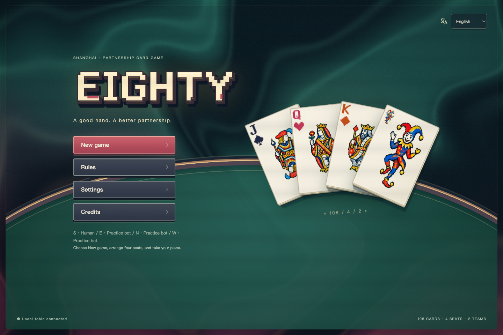
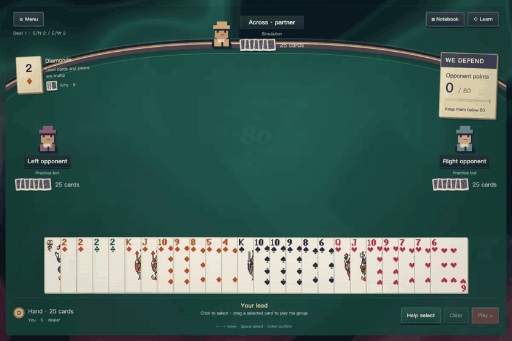

<p align="center">
  English · <a href="README.md">简体中文</a>
</p>

<p align="center">
  <strong><a href="https://eighty.tonytheyang.com/">▶ Play 80 online · No installation</a></strong><br>
  Play on desktop or phone with hosted AI, free practice bots, or your own models.
</p>



<h1 align="center">Eighty · 八十分</h1>
<p align="center"><strong>A classic Chinese card game. A pixel table worth staying at.</strong><br>Free, open source, and played right in your browser.</p>

<p align="center">
  <a href="CHANGELOG.md"></a>
  <a href="LICENSE"></a>
  <a href="https://nodejs.org/"></a>
  <a href="https://github.com/tonyyunyang/80-fen-shengji/actions/workflows/checks.yml"></a>
  <a href="CONTRIBUTING.en.md"></a>
</p>

<p align="center">
  <a href="https://eighty.tonytheyang.com/">Play online</a> · <a href="#start-a-table">Run locally</a> · <a href="docs/guide.en.md">How to play</a> · <a href="CONTRIBUTING.en.md">Contribute</a> · <a href="docs/press-kit.md">Screenshots & press kit</a>
</p>

Two decks. Four seats. Two partnerships. Someone draws trump, someone brings home the points, and someone saves just the right card for the final trick.

**Eighty is a free, open-source browser game of 80-fen**, also known as **Shengji / Tractor**. It brings a defined Shanghai ruleset to a table of pixel characters, paper cards, flowing ink and green felt. Your partner sits opposite you. Your cards stay close at hand.

**Local play needs no account, API key, or subscription.** Three free local practice bots are ready to join you. Bringing your own AI model is optional; that service may charge separately.

## See the table in motion



*Recorded from an actual deal: hover to read, select a tractor and drag it together, follow around the table, then collect the trick with scoring effects.*

[Watch the clearer video →](docs/media/arcade-gameplay-en.mp4) · [What's new in 0.3.0](CHANGELOG.md)

## Made for one more hand

| At the table | In Eighty |
| --- | --- |
| **A true partnership game** | You and the opposite seat share a team. Your opponents sit to the left and right; roles, dealer, trump and attacker points are visible on the table. |
| **A whole deal—and the next one** | Dealing, declarations and counters, kitty pickup and burial, pairs, tractors, throws, final-trick scoring and progression beyond Ace. |
| **Cards that feel good to handle** | Both 25-card and 33-card hands stay in one row. Hover opens a reading gap; click selects. Drag any selected card to play the group, or an unselected card to play it alone. The Play button works too. |
| **Pixel character, readable cards** | Original title lettering, pixel portraits, illustrated court cards, monochrome/color jokers and an optional four-color deck. Desktop tables scale to fit; phones keep larger cards, horizontal hand browsing and reachable controls. Tap to select or drag upward to play. |
| **A table that responds** | Flowing ink, foil glints, directional card landings, declaration and capture accents, scoring sparks and a round reveal. Original background music, After Eighty, and deal/play/capture/scoring effects have separate switches and volume controls. |
| **Room to learn** | A card notebook, trick review, optional learning prompts, keyboard controls, reduced motion and optional sound. |
| **Your choice of company** | Mix humans, local practice bots and your own API models by seat. Shared-device hotseat and spectator play are supported. |

[See selected-group dragging →](docs/guide.en.md#handling-the-cards)

## Meet the deck


These are the cards rendered by the game itself: separate rank indices, suit glyphs and illustrations, assembled into a readable deck that opens under your pointer.

[Explore the artwork →](docs/art.md)

## Start a table

**Play now: [Open the hosted table →](https://eighty.tonytheyang.com/)** No installation or personal API key is required. Tony provides hosted AI within the available allowance; free practice bots and your own models are also available.

To run on your own computer, install [Node.js 22 or newer](https://nodejs.org/), then:

```sh
git clone https://github.com/tonyyunyang/80-fen-shengji.git
cd 80-fen-shengji
npm ci --ignore-scripts
npm start
```

Open **[http://127.0.0.1:5173](http://127.0.0.1:5173)**, choose **New game**, arrange the seats, and play.

The default is you and three local practice bots. Setup lists **You, Teammate, Left opponent and Right opponent**, with their table positions, so each assignment is easy to locate. Appearance preferences live in **Settings**; seats and table rules live in **New game**. The menu supports Chinese and English.

For a quieter table, set **Light & effects** to **Soft** or **Off**, or turn off **Animation**. System reduced motion is respected. Sound is off by default and has its own volume control.

Desktop and phone browsers are supported. This is a **single-device table**; cross-device rooms are not available. Separate browser sessions own separate tables. The `127.0.0.1` address above runs locally; the public game is at [eighty.tonytheyang.com](https://eighty.tonytheyang.com/). To host your own instance, read the [deployment guide](docs/security-and-deployment.md).

Already installed? Stop the running server, then update and restart:

```sh
git switch main
git pull --ff-only
npm ci --ignore-scripts
npm start
```

Reload the browser afterward. Existing local saves restore paused; session API keys must be entered again after a server restart.

## Invite your own AI

Use **New game → API connections** to enter a protocol, base URL and key, read available models, and assign one to each API seat. OpenAI-compatible Chat Completions, OpenAI Responses and Anthropic Messages are supported; specific services also use a strict JSON action format.

A model receives **only its own hand and the public table**, with explicit partner/opponent roles. Normal play supplies no practice-bot candidate. Optional experimental endgame analysis compares plausible remaining deals. Failures fall back to the local practice policy, with genuine model actions and fallback recorded separately.

Keys stay in server memory for the owning browser session, never in browser storage or replays. Use a server you trust. Playing strength is still being developed; professional-level play or consistent superiority over the practice bot is not established.

[Connections & AI](docs/ai.md) · [Evaluation methods & results](docs/research/ai-evaluation.md) · [Privacy & hosting](docs/security-and-deployment.md)

## Enjoy the game. Make it yours.

**Play it, fork it, and send a PR.** Contributions are not limited to algorithms: a smoother interaction, a better translation, a new illustration, or a reproducible rules bug can make the next deal better.

- [Found a bug? Open an issue](https://github.com/tonyyunyang/80-fen-shengji/issues/new/choose)
- [Want to contribute? Start here](CONTRIBUTING.en.md)
- [Like the table? Give it a star and share it with a card-playing friend](https://github.com/tonyyunyang/80-fen-shengji)

This is a spare-time project. **Pull requests are reviewed periodically**, so a reply may take a while. Clear explanations, focused changes, and relevant screenshots or reproduction steps make reviews easier.

## Docs & development

```sh
npm test
npm run check
```

Routine checks run offline and spend no model credits. `public/index.html` is the only game entry point.

`main` contains the latest game improvements, music, mobile controls and optional Cloudflare runtime. Local `npm start` defaults to practice bots and personal API connections. The maintained [`codex/tonytheyang-site`](https://github.com/tonyyunyang/80-fen-shengji/tree/codex/tonytheyang-site) branch is the production deployment channel: it receives `main` updates and uses the explicit `production` configuration with Worker Secrets. See [branch and deployment ownership](docs/site-edition.md).

[Documentation](docs/README.md) · [Rules](docs/rules.md) · [Architecture](docs/architecture.md) · [Art & media](docs/art.md) · [Roadmap](docs/roadmap.md) · [Changelog](CHANGELOG.md)

## Credits

Created by [Tony Yun Yang](https://github.com/tonyyunyang) and contributors. Thanks to **ChannonTian** for the rules and practice-policy foundation in [80fen](https://github.com/ChannonTian/80fen), and to **GPT-6 Astra** for development assistance. Court, joker and card-back illustrations were AI-generated; title lettering, suit glyphs, portraits, flowing backgrounds, interface effects and synthesized sound are project work.

[Balatro](https://www.playbalatro.com/) is a visual inspiration. Eighty is an independent project, not an official Balatro product.

Open source under **[Apache-2.0](LICENSE)**. See [NOTICE](NOTICE) and [credits](docs/credits.md) for third-party provenance and licenses.

**Enjoy the game. May your partner have the card you need.**
