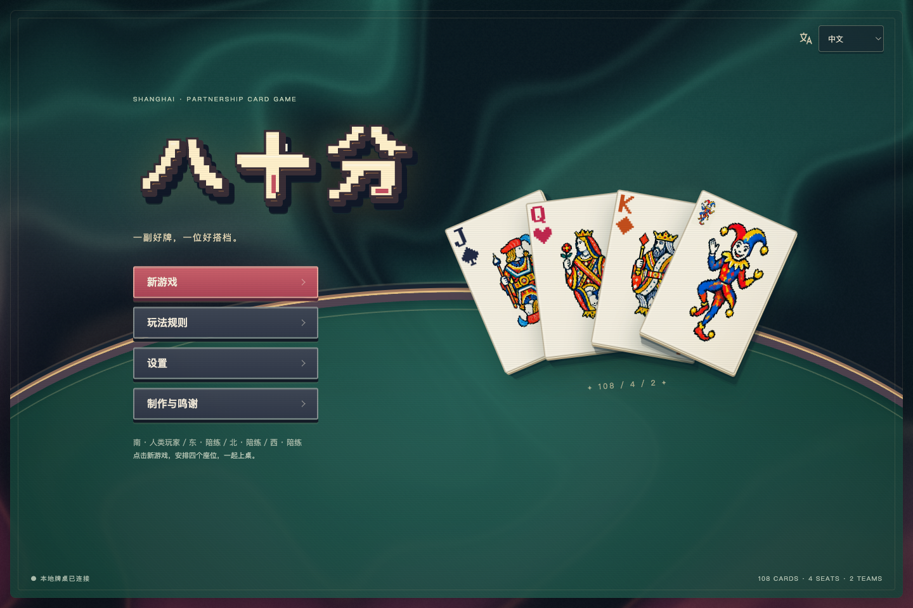

<p align="center">
  <a href="README.en.md">English</a> · 简体中文
</p>

> **个人网站定制分支：** `codex/tonytheyang-site` 负责 Tony 网站上的 Eighty
> 部署与可选赞助 AI，继续在本仓库维护。[部署与版本管理说明](docs/site-edition.md)。
> 当前配置默认关闭付费模型；创建这些文件并不代表在线服务已经发布。



<h1 align="center">八十分 · Eighty</h1>
<p align="center"><strong>经典中国牌戏，一张有温度的像素牌桌。</strong><br>免费、开源，在浏览器里重新遇见八十分。</p>

<p align="center">
  <a href="CHANGELOG.md"></a>
  <a href="LICENSE"></a>
  <a href="https://nodejs.org/"></a>
  <a href="https://github.com/tonyyunyang/80-fen-shengji/actions/workflows/checks.yml"></a>
  <a href="CONTRIBUTING.md"></a>
</p>

<p align="center">
  <a href="#开始游戏">开始游戏</a> · <a href="docs/guide.md">怎么玩</a> · <a href="CONTRIBUTING.md">一起改进</a> · <a href="docs/press-kit.md">图片与宣传素材</a>
</p>

两副牌，四个人，两对搭档。有人调主，有人跑分，有人默默为最后一墩留下一张王牌。

**Eighty 是免费开源的八十分网页游戏**，也叫升级、拖拉机。它采用一套明确的上海规则，把熟悉的搭档牌戏放进像素人物、纸质牌面、流动光影与绿色绒面的牌桌里。对家就在对面，手牌就在手边。

**本地游玩无需账号、API key 或订阅。** 自带三个免费的本地陪练，打开就能练一局。也可以让自己的 AI 模型入座；这是可选功能，费用由你选择的服务商决定。

## 看它动起来


*录制自实际牌局：悬停展开，选好整组拖拉机一起出牌，四家跟牌，收墩与得分特效。*

[看清晰版录像 →](docs/media/arcade-gameplay.mp4) · [0.3.0 更新记录](CHANGELOG.md)

## 为一局好牌做的细节

| 牌桌上的乐趣 | Eighty 的做法 |
| --- | --- |
| **真正的搭档牌戏** | 你与对家一队，左右两家是对手；攻守身份、庄家、主牌与攻方得分都摆在桌上。 |
| **完整的一局，也有下一局** | 发牌、亮主与反主、拿底扣底、对子、拖拉机、甩牌、抠底计分与升级，一路打过 A。 |
| **手牌有手感** | 25 张与拿底后的 33 张都保持一排。悬停平滑展开，单击选中；拖动任一已选牌即可整组出牌，未选牌单独拖出。也可按「出牌」确认。 |
| **像素画面，清楚读牌** | 自绘标题、像素人物、人头牌、黑白／彩色大小王，以及可选的四色花色。整桌随窗口缩放。 |
| **出牌有回应，收分有声色** | 流动背景、牌面微光、方向落牌、亮主与收墩提示、得分火花和结算揭晓。特效可选华丽／柔和／关闭，纸牌与得分音效可单独开启。 |
| **想学就慢慢学** | 记牌簿、一墩回看、边玩边学、键盘操作、减少动态效果与可选音效。 |
| **每席都能自己安排** | 人类、本地陪练、自己的 API 模型自由搭配；支持同设备轮流操作与观战。 |

[看看整组选牌如何拖出 →](docs/guide.md#牌怎么拿)

## 一副值得细看的牌


牌面不是一张盖在游戏上的截图：角标、花色、像素字形与人物插画由游戏实际组合渲染。鼠标经过时，它们会在你的手里展开。

[看完整牌面与美术说明 →](docs/art.md)

## 开始游戏

先安装 [Node.js 22 或更新版本](https://nodejs.org/)，然后：

```sh
git clone https://github.com/tonyyunyang/80-fen-shengji.git
cd 80-fen-shengji
npm ci --ignore-scripts
npm start
```

打开 **[http://127.0.0.1:5173](http://127.0.0.1:5173)**，选择「新游戏」，安排四个座位，开桌。

默认是你和三个本地陪练。座位按「你、队友（对家）、上家对手、下家对手」排列，并标明对面、左侧和右侧，方便逐席安排。画面偏好在主菜单的「设置」里；座位和本桌规则在「新游戏」里。菜单支持中文与 English。

想让牌桌安静一些，可在「光影与特效」选择「柔和」或「关闭」，也可关闭「动态效果」；系统的减少动态效果设置同样生效。音效默认关闭，开启后可独立调整音量。

这是**单设备牌桌**，主要为电脑浏览器设计；目前没有跨设备联机房间。项目没有官方在线试玩站点，上面的地址是你启动后的本机游戏。需要部署自己的实例，请看[部署指南](docs/security-and-deployment.md)。

已经安装过？先停止正在运行的服务，然后更新并重启：

```sh
git switch main
git pull --ff-only
npm ci --ignore-scripts
npm start
```

最后刷新浏览器。原有本地存档会暂停恢复；API key 只在内存中，重启后需要重新填写。

## 把自己的 AI 请上桌

在「新游戏 → API 连接」填写协议、基础地址和 key，读取模型列表，再逐席选择模型。支持 OpenAI Chat Completions 兼容、OpenAI Responses 和 Anthropic Messages；特定服务也支持严格 JSON 动作。

模型只收到**自己的手牌与公开牌桌信息**，明确知道谁是搭档、谁是对手。正常出牌不提供陪练候选；可关闭的实验性残局推演会比较可能的剩余分牌。失败或超时由本地陪练接手，结果会分别记录。

key 仅保存在所属浏览器会话的服务端内存中；不会写入浏览器存储或牌谱。请只把 key 交给你信任的服务器。AI 棋力仍在打磨，当前没有职业水平或稳定强于陪练的保证。

[连接与 AI 说明](docs/ai.md) · [评测方法与结果](docs/research/ai-evaluation.md) · [隐私与部署](docs/security-and-deployment.md)

## 喜欢这张牌桌？一起把它做好

**欢迎玩，欢迎 Fork，也欢迎提交 PR。** 不一定要改算法：一处手感修正、一句更自然的翻译、一张新插画、一个规则复现，都能让下一局更好。

- [发现问题 → 开 Issue](https://github.com/tonyyunyang/80-fen-shengji/issues/new/choose)
- [想动手改进 → 阅读贡献指南](CONTRIBUTING.md)
- [喜欢这个项目 → 点一颗 Star，把它分享给牌友](https://github.com/tonyyunyang/80-fen-shengji)

这是利用业余时间维护的项目，**PR 会不定期查看与审核**，回复可能不会很快。清晰的说明、小而完整的改动，以及相关截图或复现步骤，会让评审更顺利。

## 文档与开发

```sh
npm test
npm run check
```

日常检查全部离线，不消耗模型额度。唯一游戏入口是 `public/index.html`。

[文档导航](docs/README.md) · [规则细则](docs/rules.zh-CN.md) · [架构](docs/architecture.md) · [美术与媒体](docs/art.md) · [路线图](docs/roadmap.md) · [更新记录](CHANGELOG.md)

## 制作与鸣谢

由 [Tony Yun Yang](https://github.com/tonyyunyang) 与贡献者制作。感谢 **ChannonTian** 的 [80fen](https://github.com/ChannonTian/80fen) 提供规则与陪练基础，感谢 **GPT-6 Astra** 协助开发。人头牌、大小王与牌背使用 AI 生成；标题字形、花色、人物、流动背景、界面特效与合成音效是项目中的原创设计。

[Balatro](https://www.playbalatro.com/) 是视觉灵感来源。Eighty 是独立项目，不是 Balatro 的官方产品。

以 **[Apache-2.0](LICENSE)** 开源；第三方来源与许可见 [NOTICE](NOTICE) 和[鸣谢](docs/credits.md)。

**祝你有好牌，也有好搭档。**
