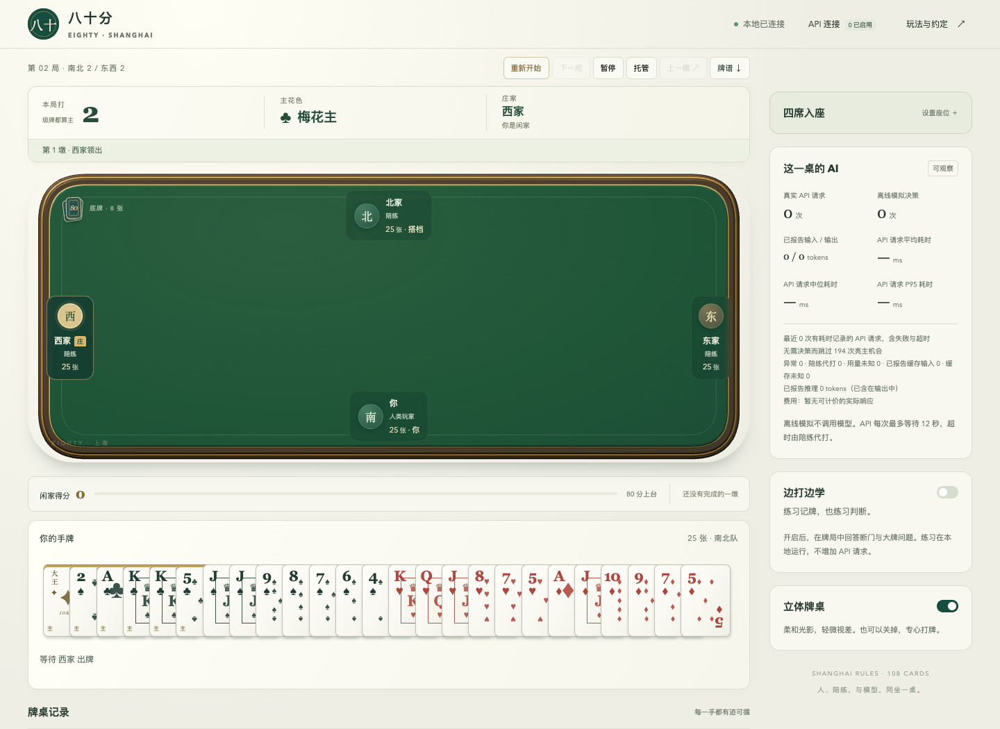

# 八十分 · Eighty

一个在浏览器里玩的上海规则八十分（升级）游戏。四个座位可以自由搭配**人类、陪练和真正通过 API 决策的模型**。

- 两副牌、亮主 / 反主、扣底、对子、拖拉机、甩牌和升级。
- 连续发牌，AI 在后台决定是否亮主；出牌通过工具调用完成。
- 立体牌桌、翻面收牌、上一墩回看、记牌小练习。
- **重新开始**可重开整桌；一局结束后点**下一局**继续升级。
- 不填 key 也能玩：未启用的 API 席位由陪练代打。



## 本地运行

需要 **Node.js 22 或更新版本**。

```sh
git clone https://github.com/tonyyunyang/80-fen-shengji.git
cd 80-fen-shengji
npm ci --ignore-scripts
npm start
```

打开 [http://127.0.0.1:5173](http://127.0.0.1:5173)，点击「入座开局」。刷新页面可继续当前牌局。

## 用自己的 API 玩

1. 点击右上角 **API 连接**。
2. 选择预置连接，或新增自己的连接 / 套餐，填写基础地址、接口协议和模型列表。
3. 粘贴自己的 key，点击「保存 / 启用 API」。保存不会自动发起付费测试。
4. 在「四席入座」中，为每个 API 席位选择连接和模型。

支持 OpenAI Chat Completions 兼容接口、OpenAI Responses 和 Anthropic Messages。默认模型为 **Qwen 3.8 Flash**；也可添加其他支持**文字输入和工具调用**的模型。预置价目是带核验日期的参考，自己的套餐可以填写自己的输入 / 输出参考价。

每次 API 决策最多 **12 秒**，包括重试；失败或超时由保留的陪练策略接手。默认每桌最多 **100 次请求**，可在设置中调整。费用是基于已报告 tokens 的估算；未报告的用量会标为未知，实际扣费以提供商账单为准。重新开始不会撤销已产生的费用，最近 20 桌用量可回看。

## key 和数据

- 仓库不包含 API key。网页也不会预置开发者的 key。
- key 仅在当前浏览器会话对应的**服务端内存**中使用，不写入 localStorage、存档、牌谱或日志。可随时清除；重启服务后需要重新输入。
- 不同浏览器会话的牌局和连接互相隔离；同一浏览器的标签页共享会话。
- 使用他人部署的站点时，其服务端会接触你的 key。想自己控制服务端，可按上面的方式自行运行。
- 私有存档保存在被 Git 忽略的 `data/` 中。

## 部署与开发

这是需要 Node 后端的应用，适合放在 HTTPS 反向代理后运行。具体配置、会话清理和限制见 [部署与密钥说明](docs/security-and-deployment.md)。本项目目前提供独立的浏览器牌桌，不提供跨设备多人房间。

```sh
npm test
npm run check
```

常规测试离线运行，不消耗模型额度。规则、API、界面和开发约定分别见：[规则](docs/rules.md)、[模型协议](docs/player-protocol.md)、[界面设计](docs/table-experience.md)、[开发工作流](docs/development-workflow.md)。

## 来源

规则参考 [ChannonTian/80fen](https://github.com/ChannonTian/80fen)，引擎、界面和 API 接入独立实现。陪练策略保留原始实现及 Apache-2.0 许可，见 [来源与校验](vendor/peilian/README.md)。Three.js 和 ipaddr.js 遵循各自的 MIT 许可。
