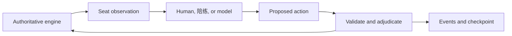

# AI player design rationale

Updated 2026-09-08. The implementation contract now lives in [player-protocol.md](player-protocol.md); selected game behavior lives in [rules.md](rules.md). This document explains the design choices and remaining experiments.

## Ownership

The authoritative engine owns cards, phase transitions, validation, adjudication, scores, and levels. Every player receives a seat observation and proposes an action. The core imports neither the preserved strategy nor provider clients.

Physical card identity, decision identity, and versioning prevent duplicated cards and stale responses from changing the game. Failed throws are rules-adjudicated outcomes; malformed responses are rejected before mutation.

## Calls during dealing

Receiving a card is a local engine event. At a permitted declaration opportunity, the engine computes executable options. If only pass is possible, no model is called. If a bid, reinforcement, or counter is possible, the selected player chooses an option or passes. A changed partial hand can justify another decision even when the legal menu is unchanged. Passing applies to the current opportunity only.

The controller now deals continuously, at 500ms per card by default. API decisions run privately without stopping the clock. One request per seat plus a latest-observation review prevents obsolete queues. Eligible players get one final review per closing context. The shared closing countdown is five seconds and renews only after accepted bids. Stale competing bids disappear privately; they do not trigger repairs or automatic pair upgrades. See [the implementation contract](continuous-dealing.md).

The current API decision deadline is 12 seconds including any repair attempt. Timeout recovery uses the preserved 陪练 strategy for that exact decision; the next decision remains an API opportunity. The engine enforces the same rules and private-information boundary for the model and fallback. This ensures defined behavior on service failure, but cannot guarantee that successful model choices are as strong as 陪练.

Model-authorized waiting remains a future optimization: the model could explicitly defer until a bounded visible condition. Fixed checkpoints, end-only bidding, or delegating bids to 陪练 would be separately labeled player/rule changes. We do not silently apply them to API seats.

## Context and cost

The initial provider request uses a self-contained compact seat observation plus a stable rules/tool prefix. Full current hand state is rebuilt locally, so skipped draw notifications do not cause memory loss. Public play order is retained. The model never receives secret shuffle information, opponents' hands, or an unknown kitty. Learner answers and quizzes stay outside player context.

The current implementation exposes small declaration choices and exact follow obligations. The first live test found that direct card IDs still allowed repeated pair-follow mistakes. Following decisions now use a complete legal-combination menu when it fits bounded enumeration and payload limits; the model selects a move ID. A unique legal move needs no API call. Larger follow sets, leads, and burying retain direct card IDs. Complete menus remove legality work without choosing a strategy for the model; they are never truncated to a heuristic-ranked shortlist.

Tool-only output constrains the interface but does not make inference free. Strict schemas validate structure, while the engine separately checks game legality. See [OpenAI function calling](https://developers.openai.com/api/docs/guides/function-calling#strict-mode). Reasoning tokens may be billed within output; avoid counting them twice when normalizing usage. See [reasoning accounting](https://developers.openai.com/api/docs/guides/reasoning#how-reasoning-works).

Stable prefixes may benefit from caching, but minimum lengths, write/read charges and model support vary. Compare total measured costs rather than assuming the shortest prompt is cheapest. See [prompt caching](https://developers.openai.com/api/docs/guides/prompt-caching#how-to-optimize-prompt-caching). The present UI reports known usage and flags unknown usage; it does not invent currency estimates.

## Verification and further experiments

Offline fixtures exercise the native OpenAI, Claude and Qwen response shapes, malformed/extra actions, missing tools, truncation, retry/fallback, request caps, and late replies. A simulated API seat is explicitly local and is not evidence of a model's ability to play.

Use [bounded live evaluations](live-api-testing.md) to verify a configured provider; routine fixtures establish protocol behavior, not strategic quality. Further experiments can compare prompt encodings, retained conversations, or bounded waiting against the self-contained baseline. Use paired deals, seat/team rotation, uncertainty, and separate accounting for fallback-assisted games.
