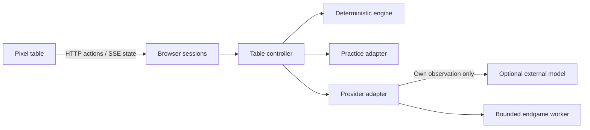

# Architecture

[Documentation](README.md) · [Contributing](../CONTRIBUTING.en.md)

Eighty is a small Node application with a plain JavaScript/HTML/CSS client. There is no frontend build step, database service or WebGL dependency. `public/index.html` is the only production interface.

## Boundaries

| Area | Responsibility |
| --- | --- |
| `src/cards.js`, `src/rules.js`, `src/game.js` | Physical card identities, classification, legal actions, scoring and deterministic state transitions. |
| `server/session.js`, `server/bidding.js` | Scheduling, human/AI turns, continuous dealing, receipt-time validation and the shared deadline. |
| `server/browser-sessions.js`, `server/connections.js` | Cookie ownership, private saves and in-memory credentials. |
| `server/safe-network.js`, `server/model-discovery.js` | Validated public provider destinations, pinned DNS, bounded responses and model discovery. |
| `src/peilian.js`, `vendor/peilian/` | Adapter around the preserved local practice policy. The vendor core is not the authoritative engine. |
| `src/providers.js`, `src/*context.js`, `src/expert-*.js` | Permitted observations, structured action contracts and model guidance. |
| `src/analysis-worker.js`, `src/endgame-estimates.js` | Bounded hypothetical endgames off the server event loop. |
| `public/app.js`, `public/pixel-view.js` | Menu/setup flow, the current table and public state rendering. |
| `public/hand-*.js`, `public/table-*.js` | Stable hover, one-card drag, selection, layout, animation timing and sound. |
| `public/card-art.js`, `public/card-glyphs.js`, `public/wordmark.js` | The actual deck and original drawn lettering. |
| `test/` | Offline regression examples, HTTP isolation, rules, provider parsing and timing. |

## State and privacy

The browser sends a decision-bound action, not a replacement game state. The engine validates ownership, count, suit and structure before mutation. Public views redact hidden information; each API seat gets its own observation.

The server owns one controller per browser session. Cookies and CSRF checks prevent another browser from operating that controller. A changed game generation rejects late model actions while retaining auditable usage. See [the player protocol](player-protocol.md) and [session security](security-and-deployment.md).

## Rendering and time

The table uses accessible HTML cards. Resting card slots provide hit testing; animated faces do not decide pointer ownership. A measured logical scene fits the viewport, and pointer coordinates are converted back into scene units. 25 and 33 cards share one row.

Server dealing time is independent of private model work. The presentation clock holds, flips and collects completed tricks without delaying engine decisions. See [continuous dealing](continuous-dealing.md) and [table behavior](table-experience.md).

## Local data

`data/`, `.env`, `output/` and browser automation traces are ignored. They are not release inputs. Media fixtures also stay under `output/`; only curated images/GIFs enter `docs/media/`.

Retired table implementations and prototype worktrees are not part of the source tree. Historical AI context profiles remain available for controlled comparisons; they do not add alternate game interfaces.
