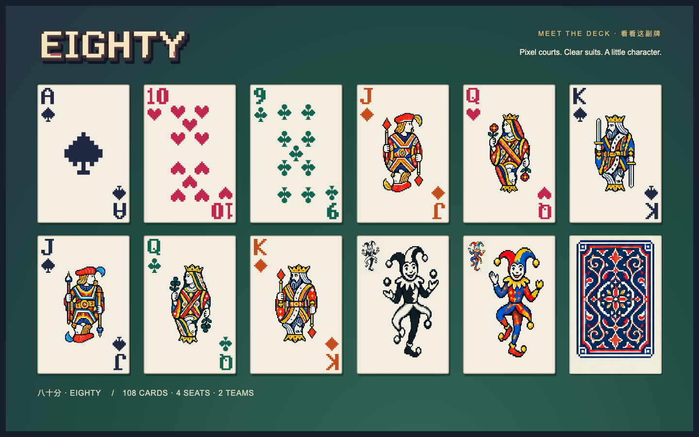

# The visual table

[Press kit](press-kit.md) · [Credits](credits.md) · [Media files](media/README.md)

Eighty's visual language combines green felt, a curved brass rail, warm paper, clear suit colors and small pixel characters. The 0.3.0 finish adds flowing ink, foil glints and public-event effects around the same deck and title lettering used during play.

[Current table](media/arcade-table.png) · [Chinese gameplay](media/arcade-gameplay.mp4) · [English gameplay](media/arcade-gameplay-en.mp4)

## Source of the artwork

- `public/wordmark.js`: original Chinese and English title shapes, with stepped edges and layered color. These are not a substituted display font.
- `public/card-glyphs.js`: SVG pixel ranks and suits. Suit shape remains meaningful even with the optional four-color palette.
- `public/card-art.js`: assembles indices, pips, court illustrations and jokers.
- `public/assets/cards/pixel-court.webp`: the approved AI-generated 4×4 court/joker/back atlas. Keep this source intact when changing layout.
- `public/pixel-view.js`, `public/pixel.css`: portraits, paper, felt, shadows and table details.
- `public/atmosphere.js`: original procedural ink shader, with bounded native WebGL rendering and a static CSS fallback.
- `public/effects.css`, `public/table-effects.js`, `public/effect-flow.js`: original foil gradients, arcade surfaces, public-event flourishes and their presentation-only timing.
- `public/table-sound.js`: original varied paper flicks, grouped card landings, collection/score notes and round endings.
- `public/table-music.js` and `public/assets/audio/after-eighty.mp3`: the approved original **After Eighty** score. A gesture enables audio; music and effects have separate volume controls. Music decodes once and loops locally, preserving its place across menus and hidden-tab pauses. Its source is in `audio-src/after-eighty/`.

Both 25-card and 33-card hands use the same renderer. Hover moves the painted faces while hit testing stays on stable slots. Court art keeps its proportions; pip fields leave space for both index corners.

The arcade pass studies the [official Balatro press kit](https://www.playbalatro.com/press-kit/), including its [card-reveal animation](https://www.playbalatro.com/press-kit/Gifs/Balatro_gif_1%20.gif) and [gameplay animation](https://www.playbalatro.com/press-kit/Gifs/Balatro_gif_2%20.gif). Flowing ink, foil light and the cadence of score accents inform the implementation. All added shader, surface, particle and sound code is authored for Eighty; this pass adds no downloaded game assets and keeps the existing atlas and title source intact.

## Contributing art

Keep printed rank and suit readable at normal playing size. Check red/black and four-color palettes, duplicated physical cards, selected states, table fans and a narrowed window. Use pictures for the two jokers rather than adding unfamiliar HI/LO labels.

Preserve original source assets, and document provenance and license for additions. New artwork should fit the existing table, not introduce another renderer or demo page. SVG/code-native assets are preferred for glyphs and interface shapes; bitmap illustrations belong in the atlas or a reviewed replacement.

[Balatro](https://www.playbalatro.com/) is an inspiration for the pixel-card mood, not an affiliation. Project-generated art and code are covered by [the project license](../LICENSE); third-party trademarks and official assets are not granted by it.

The main menu's audio button enables music and effects together. Settings can
control them separately and audition the table cues. Dealing uses a quiet paper
flick; group plays use a short sequence. Point notes coincide with collection,
or the immediate result when motion is reduced. Crossing 80 has a stronger
accent, and round endings use their own short phrase. Hidden or paused table
events never produce a backlog of sounds on return.
