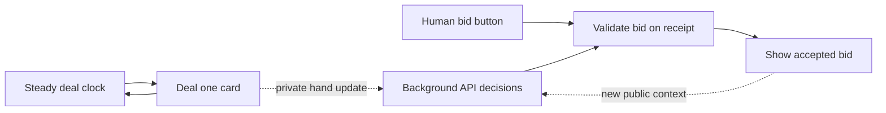

# Continuous dealing and private bidding

Status: implemented, 2026-09-08. New tables with zero or one human use continuous dealing; the default is one human plus three Qwen 3.8 Flash seats. The clock is 500ms per card (700ms optional), and closing lasts at least five seconds. This replaces the blocking declaration loop for normal browser play. Existing checkpoints and multi-human shared-screen games retain the explicitly labeled ordered mode.

## Problem and intended experience

The previous engine stopped dealing only when the receiving player had a legal declaration choice. That interruption revealed eligibility even if the player passes. During drawing, the public pending seat, API thinking indicator, request counters, and request logs can convey the same information. Hiding only the animation would leave the underlying problem.

The intended experience is a steady stream of cards. A human can call 叫主/反主 whenever their received cards permit it. API decisions happen privately in the background. Only an accepted, openly shown bid interrupts the conversation at the table; it does not stop the deal clock. Nobody must explicitly pass to let the next card arrive.

## Implemented flow

1. **An independent deal clock.** Use 500ms per card as the initial normal pace: approximately 50 seconds for 100 cards and one new card in each player's hand every two seconds. The previous 250ms suggestion meant one card per second in a particular hand, not four cards per second for that human, but 500ms allows more reading time. Offer a slower 700ms pace before the deal if needed; tune using actual play feedback rather than claiming a universal human-speed threshold. The pace never changes because a player can bid, is thinking, passes, or times out. Mechanical draw ticks remain separate from player proposals.
2. **Human bids stay available.** Show the human their own arriving cards and private legal bid buttons. They can click while dealing continues. Silence means no bid now; it does not surrender later opportunities. Keep selected cards and bid controls stable as new cards arrive.
3. **API bids run concurrently.** Each API receives only a snapshot of its partial hand, public declarations and levels, and the legal choices at that instant. It uses the existing declaration tool. At most one request may be in flight per seat. New draws update a single “latest state needs review” flag; they do not create a queue of obsolete requests. When a request finishes, another eligible evaluation uses the newest snapshot. Start with a private two-second minimum interval between request starts, adjustable after measurement. No legal choice means no paid call.
4. **Apply bids when received.** Receiving additional cards does not automatically invalidate a snapshot-based bid. The choice must have been offered in that request's snapshot and must still be legal against the current declaration and hand. The first valid bid received wins that race. If a human's single level-card bid has already been accepted, a later API single level-card bid is discarded privately, with no card flash, notification, timer extension, or public error. Never upgrade that single into a pair, substitute another suit, or ask 陪练 to repair it automatically. A legal matching level pair or joker pair would require a separate new decision. A bid cannot become valid merely because a required card arrived after the request was sent. Accepted bids show the required cards and take effect immediately, while dealing continues.
5. **A common closing countdown.** After card 100, always show at least five seconds for final 叫主/反主. Every actual accepted bid restarts a full five-second response window, including an unbeatable big-joker pair; do not shorten the configured minimum. Only increasing strengths 1 → 2 → 3 → 4 are possible, so at most four bid-triggered extensions can occur after dealing, giving a finite maximum of approximately 25 seconds in the most extended case. The API's separate 12-second decision ceiling does not cut short this public window. Pending requests, passes, rejected proposals, and timeouts never extend it. At closure, finalize trump and give the dealer the kitty.

Record these timings in game configuration and test their feel. Five seconds is the closing-window minimum; it is not a requirement to make an API request or to wait for an API response.

## Selective final review

Use exact current rule eligibility, not a strategy probability or an assumption about who might want to bid.

- If a seat has no legal non-pass declaration or counter, make zero requests. This includes seats unable to beat the current declaration, even if they hold some trump cards.
- If a seat is eligible, allow one final review at entry into closing, even if it passed earlier during drawing. Its complete hand and the closing phase are new decision context.
- If an in-flight request already covers the same complete hand, public declaration revision, and closing phase, reuse it. Otherwise mark just one latest review pending; do not start a second simultaneous request for that seat.
- A pass on that exact closing context is final for that context. Do not ask again on each countdown tick. An actual new public bid changes the context; recompute legality and request another decision only from seats that still have a legal choice.
- A response from the drawing phase does not itself count as the closing-phase review. If it passes, an eligible seat may still receive that one final review while time remains. No future cards or later public facts are retroactively inserted into an earlier request.

Use a review key containing game/redeal identity, hand revision, declaration revision, and phase. The passing clock alone is not a new key. A request may still lose a race; record the superseded response privately and count its usage, without automatically promoting its action or giving it a public effect.

## Timeouts, stale replies, and fairness

The API's 12-second maximum still applies, including repairs. During dealing, the clock keeps running while that timer runs. If a request fails, use the preserved 陪练 with the latest permitted observation, then validate its decision normally. A fallback pass stays private. A fallback bid shows its cards like any other actual bid.

A well-formed bid that became stale while the model was thinking is a superseded proposal, not a provider failure. It does not trigger an automatic repair request or 陪练 bid, and does not consume the malformed-response error allowance. A fresh eligible decision may be scheduled using the normal latest-state/final-review rules.

Near the end, a bid task's deadline cannot outlive the public closing window. Reserve a small local margin before closure (initially 100ms) to cancel an unanswered request and run 陪练 against the latest state. Any resulting bid must arrive before the same cutoff applied to human and model bids. If it extends the window, the extension is caused by that public bid, not by waiting for the API. Do not wait for provider acknowledgements or start another paid request in the final margin. If the window has already closed, even a fallback bid is too late. A later reply may update private usage accounting but cannot reopen bidding.

A real bid that extends the public window can move an active request's closing cutoff, but never past 12 seconds from that request's original decision start. It cannot revive a request whose action or fallback has already been finalized.

Bids from humans, API responses, and 陪练 use the same authoritative ordering of receipt and the same legal-strength rules. Do not backdate API bids to their request start time or give them priority over a bid already accepted. Specify the exact cutoff ordering in tests: external bids received at or after the closing deadline are too late. Network latency still affects how quickly an API can react; a nonblocking design cannot make remote inference instantaneous. The local fallback bounds that disadvantage, without establishing a playing-strength guarantee.

An already-received stronger bid may make an outstanding request obsolete. Keep that response private, meter it, and revalidate rather than blindly executing it. Repeated partial-hand changes should not continually cancel and restart requests, which would waste tokens and risk never receiving an answer.

## Preventing eligibility leaks

- During drawing and closing, expose the deal clock, card counts, and accepted bids. Do not expose per-seat model activity, eligible-seat queues, private passes, rejected proposals, or fallback passes in player-facing state or events.
- Human bid options are private to that human. Model observations likewise contain only that model seat's information.
- Keep declaration-request counts, timing, sizes, errors, and detailed cost records in the private audit. Do not let the live meter reveal them indirectly. Publish the complete breakdown after the deal, when the cards have been played. Card-play timing can still be shown when it is that player's public turn.
- Retain the animated thinking indicator for burying and card play, where the acting seat is already public. Do not show it for hidden bidding deliberation.

This protects the normal player interface. A developer inspecting the private server checkpoint or audit has administrative access to the game, outside that player-information boundary.

## Implementation

The pure core exports `drawCard`, `applyBid`, and `closeBidding`. The runner's `Bidding` controller owns the clock, per-seat jobs, cooldowns and completed review keys. `api-decision.js` shares the bounded request/retry/fallback and metering logic with ordinary card turns.

A bid binds game identity, deal epoch, and the received-hand prefix length. API proposals must also belong to the immutable original menu. Later draws do not invalidate an otherwise legal choice; current declaration strength is always checked again. Human bids use the same current-strength check and received-card boundary. The engine contains no network or wall-clock calls.

Private request starts, passes, superseded proposals and late usage writes do not emit SSE packets. Normal player state withholds current-deal statistics and logs until completion, while the private audit keeps every attempt. Checkpoints retain remaining clock time and completed review keys; restoration is paused, and interrupted requests become unknown usage. Late actions cannot affect a resumed or replacement game.

`createGame` keeps an ordered default for historical standalone rule fixtures; `Session.start` explicitly chooses continuous mode for normal tables. The timing mode is recorded in state, configuration and replay metadata.

Use the initial one-human/three-API table for this change. Several humans sharing one screen still require the existing handoff curtain; fully simultaneous private human bidding would need separate private views. Keep that product boundary explicit rather than pretending a single shared screen supports both private hands and uninterrupted access for everyone.

The 100-request table allowance remains shared across the three API seats. Do not silently increase it. Meter bidding separately in the private audit so we can measure how much allowance remains for card play. Exhaustion uses the established 陪练 fallback.

## Verification requirements

- With a controlled clock and no accepted bids, draw timestamps and public player views are the same whether an opponent has no legal bid, passes through the API, or has a hung request. All 100 cards arrive without waiting for a player.
- A human can bid between draws, sees no future cards, and never needs to press pass to advance dealing.
- Three API seats can think concurrently. Each has at most one request in flight and one latest-state refresh, with no backlog per card.
- A human single bid followed by an API single bid yields exactly one public declaration. The API bid is privately superseded, with no automatic pair upgrade, fallback bid, or visible error. A separately chosen legal pair may later counter it.
- A valid bid from an older partial hand still works; an option absent from its original snapshot, an invalidated counter, and a reply from an old game/redeal cannot act.
- Closing lasts at least five seconds and a real bid renews the full window. Ineligible seats make zero calls; an eligible previous passer gets at most one review per complete-hand/declaration/closing context. An existing matching request is reused and countdown ticks do not trigger requests.
- Simultaneous bids and the closing cutoff have reproducible ordering. Only actual accepted bids extend the common countdown; no API response can stall or reopen it.
- Timeout/cap recovery uses the preserved 陪练. Every attempt and late usage update is accounted for once. No private request activity appears in normal player state, events, or metrics before disclosure is allowed.
- Keep card-conservation, declaration-strength, scoring, privacy, replay, and existing card-play deadline checks passing.
- Then verify a human plus three API fixtures in desktop and narrow browser layouts, and run a bounded live check if needed. Host the user-facing play page only after these checks pass.

The concurrency change has its own feature branch and regression tests in `test/continuous.test.js`. The earlier proposal remains available in Git history. Continue validating changes with actual play feedback.
