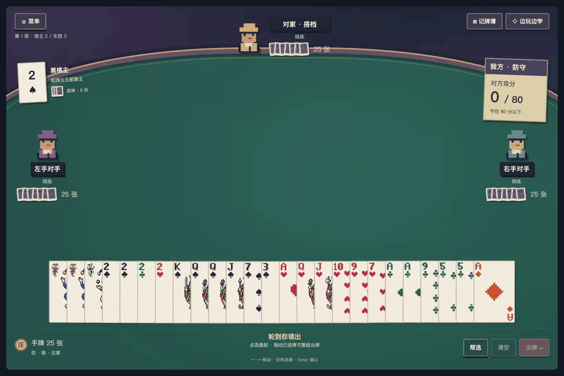

# Take a seat

[简体中文](guide.md) · [Project home](../README.en.md) · [Full rules](rules.md)

Your partner is the opposite seat; the players to your left and right are opponents. Two decks give 108 cards: 25 per player and eight in the kitty. Fives score five points; tens and kings score ten; other cards score zero.

The dealer's partnership defends. The other team attacks. **Attackers take over at a final total of 80 or more; defenders must keep them below 80.** The score ticket always displays attacker points, so it shows your opponents' points when you defend.

## Start a table

Choose **New game**. Assign each seat to a human, local practice bot or your own API model. The default is you and three free practice bots. The first dealer is random. Seats and rules are configured here; card/text sizes, colors and motion live in the main menu's **Settings**.

Multiple humans can share one device, with a privacy curtain between hands. This is not a networked room. With no human seats, you can watch the game.

## A deal, in order

1. **Deal and declare.** Cards arrive one by one. A received level card can declare a trump suit, a matching pair can beat a single, and joker pairs can declare no-trump. Revealed cards stay on the table until trump is settled. The completed deal has a shared closing window of at least five seconds.
2. **Take and bury the kitty.** The dealer temporarily holds 33 cards, then selects exactly eight to bury. Consider control, structure, weak suits and the points exposed in the kitty.
3. **Lead and follow.** The dealer leads first. Play a single, pair, tractor or a throw in one effective suit. Others follow count, suit and structural obligations; the winner collects the trick and leads next.
4. **Finish and advance.** Empty hands end the deal. If attackers win the last trick, multiplied kitty points join their score. Next deal preserves the teams, settings and match levels. Passing Ace wins the match.

## Handling the cards

| Input | Result |
| --- | --- |
| Hover over the hand | Smoothly open a reading gap. The hand always stays in one row. |
| Click | Select or unselect; selected cards lift in your hand. |
| Drag an unselected card onto the table | Carry only that card. A legal single plays immediately; an incompatible drop returns it. |
| Select a group, then drag any selected card | Carry the entire selection. A legal drop plays the group; an invalid drop returns every card to its own slot and keeps the selection. |
| Select several, then Play | Submit a pair, tractor or throw together. |
| Double-click | Select a matching pair. |
| Shift + click / arrow | Select a range. |
| ← / →, Home / End | Move keyboard focus. |
| Space / Enter | Select / confirm. |
| Escape | Cancel a drag or selection, then open Pause. |

Turn off **Drag to play** in General settings if you prefer dragging only to select. Burial always requires the confirmation button.

**Notebook** shows public card memory and completed tricks. **Learn** offers short optional exercises: skip them freely; they do not change scores or call a model.

## Continue or start again

The in-game menu offers Pause, Autoplay, Rules and Main menu. Refreshing the same browser tab reconnects to its table. Next deal retains the table settings; New game starts a fresh match at level 2. A server restart restores the saved game paused and clears session API keys.

Clearing the browser cookie can make its old local save inaccessible. See the [FAQ](faq.md).
