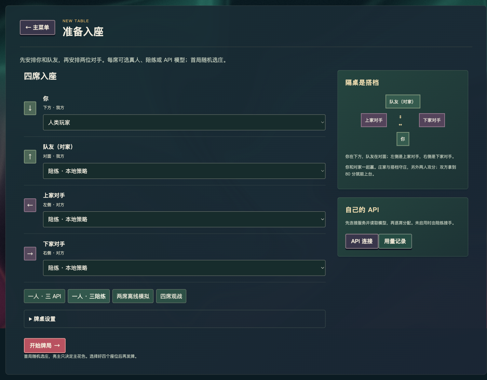
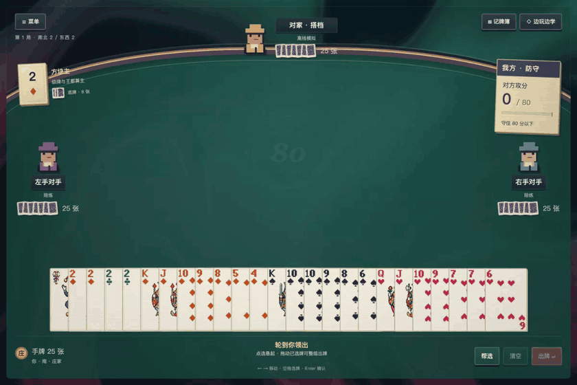

# 上桌前，认识一下八十分

[English](guide.en.md) · [项目首页](../README.md) · [完整规则](rules.zh-CN.md)

**[直接在线开桌 →](https://eighty.tonytheyang.com/)** 无需安装。线上可以使用网站提供的模型；本地运行默认使用三个陪练。

你与对家是搭档，左右两家是对手。两副扑克牌共 108 张；每人 25 张，另有 8 张底牌。5 算 5 分，10 和 K 各算 10 分，其余牌不算分。

庄家一队守庄，另一队攻分。**攻方最终拿到 80 分就能上台；守方要把它压在 80 分以下。** 桌上的记分牌始终显示攻方分数，所以我方守庄时看到的是对方得分。

## 开一张桌

从主菜单选择「新游戏」。每席可安排人类、本地陪练或自己的 API 模型；默认你和三个免费陪练。首局随机选庄。规则与座位在这里配置，牌大小、字大小、花色和动态效果在主菜单「设置」里。

座位列表先列「你」和「队友（对家）」，再列「上家对手」和「下家对手」。你在牌桌下方，队友在对面，上家对手在左侧，下家对手在右侧。座位图、模型选择和连接提示使用同一套关系名称。

多个真人使用同一设备时，游戏会在交接手牌前遮住画面；这不是跨设备联网房间。无人类座位时可以观战。

## 一局的顺序

1. **发牌与亮主。** 牌一张张发到手里。用收到的级牌亮花色，成对级牌可以反单张，大／小王对可亮无主。已亮的牌留在桌上，定主后归回手牌。发完后还有至少五秒的共同收尾时间。
2. **拿底与扣底。** 庄家拿起八张底牌，暂时有 33 张。选满八张扣下，回到 25 张。主控、牌型、短门和底牌分数都值得考虑。
3. **出牌与跟牌。** 庄家首攻。可以出单张、对子、拖拉机，或同一有效花色的甩牌。其他人按张数、花色和牌型义务跟牌；赢墩的一方收牌并继续领出。
4. **末墩与升级。** 全部手牌出完后结算。攻方赢末墩，还会取得按规则翻倍的底牌分。下一局保留队伍、设置与级数；打过 A 赢得整场。

## 牌怎么拿

| 操作 | 效果 |
| --- | --- |
| 鼠标移过手牌 | 平滑展开看清一张牌，手牌始终是一排。 |
| 手机左右滑动手牌 | 浏览这一排大牌，不会选牌或误出；操作按钮留在屏幕内。 |
| 手机点选，再确认或向上拖出 | 选中的牌悬起；按「出牌」或向上拖动提交，扣底仍需按钮确认。 |
| 单击 | 选中／取消，选中的牌悬在手中。 |
| 拖动一张未选中的牌 | 只带起这一张；合法时直接打出，不合法时滑回。 |
| 选好多张，再拖动任一已选牌 | 整组选牌一起带起；放到桌上合法即出，不合法则全部回到各自位置，保留选择。 |
| 选好多张，再点「出牌」或按 Enter | 同样可以一起出对子、拖拉机或甩牌。扣底始终需要按钮确认。 |
| 双击 | 选择对应的一对。 |
| Shift + 单击／方向键 | 连续选择。 |
| ← / →、Home / End | 移动键盘焦点。 |
| 空格 / Enter | 选牌／确认出牌。 |
| Esc | 取消拖拽或选择，随后可打开暂停菜单。 |

可以在通用设置里关闭「拖动出牌」，让拖动只负责选牌。扣底始终需要按钮确认。

牌桌右上角的「记牌簿」可以回看公开牌和已完成的一墩。「边玩边学」提供小练习；可以跳过，不改变分数，也不调用 API。

## 调整牌桌氛围

在「设置 → 光影与特效」里，可以选「华丽」的流动背景、牌面微光和得分火花，「柔和」的轻量提示，或「关闭」以使用静态背景。单独关闭「动态效果」可以让牌桌静止，系统的减少动态效果设置也会生效。「复古屏幕纹理」控制扫描线。「牌桌音效」默认关闭，开启后在下一次操作时启用纸牌轻响和短促得分音，可独立调整音量。

收墩提示显示实际赢墩者和本墩分数，只有攻方收分才会推进记分牌的 80 分进度。结算时的数字滚动只是视觉效果，最终得分和底牌计算照常决定胜负。

「背景音乐」播放原创曲目《After Eighty》，与音效分别调节。切换页面或暂停后，音乐会按播放状态继续，不会反复从开头播放。

## 继续与重开

「菜单」可以暂停、托管、查看规则或回主菜单。同一浏览器标签刷新后会重新连接原来的桌。下一局保留这桌设置；新游戏会重新开一场，级数从 2 开始。重启服务器会恢复存档为暂停状态，并清除会话中的 API key。

把浏览器 cookie 一起清掉，可能就无法回到原来的本地存档。详细说明见 [FAQ](faq.md)。
