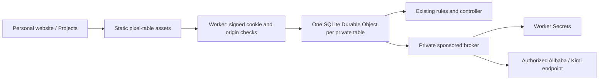

# Tony's website edition — Free hosting

**The default deployment is compatible with Cloudflare Workers Free.**
`wrangler.jsonc` uses static assets, SQLite Durable Objects and Worker Secrets.
It requires neither Containers nor R2, and does not require upgrading to a
Workers Paid subscription. Usage must remain within Cloudflare's free limits.

The website calls the game **Eighty — Classic Chinese Card Game**.
Its project cover is Collector’s Table, selected by Tony.

## One game repository

Keep `codex/tonytheyang-site` as a maintained, long-lived branch in
`tonyyunyang/80-fen-shengji`. It began at
`aa4003317dacb393e4997737e357bbf19dd45151` on `main`.

| Location | Owns |
| --- | --- |
| This repository / `main` | Shared rules, controllers, practice policy, pixel table and normal Node/BYOK app. |
| This repository / `codex/tonytheyang-site` | Website hosting adapters, sponsored connections and deployment configuration. |
| `tonytheyang.com` | Project link and promotional cover artwork. It does not vendor the game. |

Develop general game improvements for `main`, then merge the reviewed `main`
into this branch. Keep website-specific changes here. Do not delete this
branch as part of routine merged-feature cleanup. The intended public origin
is `https://eighty.tonytheyang.com/`; no service is published by editing these files.

## Why Secrets do not need a container

Worker Secrets are private runtime bindings. The browser requests an action;
the backend reads the key and calls the provider. The key is not sent to the
browser or copied into frontend JavaScript. GitHub Actions secrets can supply
a deployment, but putting their values into a frontend build would publish
those values to visitors.

The original container option preserved the Node server with few adaptations.
Its runtime, not secret storage, required Workers Paid. The default has now
been adapted to native Workers/SQLite Durable Objects. The optional legacy
container configuration remains in `wrangler.container.jsonc`; use it only if
that separate hosting choice is explicitly wanted. It is not the default build.

## Free runtime



The game remains server-authoritative. Visitors cannot select another table
by providing an ID, send replacement state, or play a model seat's cards.
Each model gets only its own observation; the shared 12-second decision
limit, receipt-time bidding validation and private bidding timing remain.

Signed, expiring HttpOnly cookies choose the table. CSRF tokens and revisions
persist with the SQLite checkpoint so hibernation does not invalidate a
legitimate next click. WebSockets use Cloudflare's hibernation API; idle
heartbeats are answered without running the game JavaScript. A disconnected
or hidden table pauses after the existing grace period. Saves expire after
seven idle days. There is no continuously running Docker process.

The Free mode uses the host's provided connections and free practice bots.
It does not collect visitors' personal keys. The optional Node worker-thread
endgame sampler is unavailable in this mode; normal practice play and the
model's own-hand/public-information decision path remain. The normal Node
app still supports its existing BYOK and optional threaded-analysis features.
The preserved practice core is unchanged; no alternate table interface is added.

`public/index.html` stays the only runtime HTML entry. The asset build copies
that existing client and its six intentionally public shared modules into
ignored `dist/free-assets/`. It does not copy server code, local saves, private
keys, `.dev.vars`, or the personal website's Lab.

## Authorized providers and private keys

The operator has authorized the supported provider endpoints for this
website. The accepted list includes ordinary API endpoints and the selected
Alibaba Coding/Token Plan and Kimi Code endpoints. A product name is not used
as a blanket authorization prohibition. Use the credentials and billing terms
approved for this deployment; do not put agreement documents or keys in Git.

Provider keys exist only as Worker Secrets. Public profiles contain fixed
model IDs and endpoint metadata, never key values. Only a validated game
controller calls the internal broker; no generic model proxy is exposed to
visitors. Requests cannot choose an arbitrary URL or credential. Provider
responses are redacted after JSON decoding, including escaped key echoes.

Sponsored connections are read-only. An operator may explicitly mark one as
`default` for the three bot seats of a fresh visitor. Retired models return to
practice bots. Daily request caps apply per session, per salted-IP visitor,
and globally, with a per-call output cap. Model failures, timeouts and exhausted
allowances retain the existing practice fallback and its separate provenance.
These are request caps, not a guaranteed currency ceiling. No live inference
is authorized merely by running tests or possessing a saved key.

Sponsorship ships **off**, with zero configured request budgets. The game can
still be played with free practice bots. The default admission limit is 100
new browser tables per day, with per-visitor creation limits; an existing valid
cookie continues to select its table. Cookies cannot be invented to bypass
this gate.

## Free limits

As checked on September 11, 2026, Workers Free includes 100,000 dynamic requests
per day and 10 ms of Worker CPU per invocation. SQLite Durable Objects are also
available on Free, with their own request, active-duration and storage quotas.
Exceeding a Free limit makes the affected operation fail; it does not silently
upgrade the account. Model usage is governed separately by the provider terms.

This is a Free-compatible implementation, not an unlimited-traffic or production
capacity guarantee. Validate the actual account usage after launch before
raising limits. Sources: [Workers pricing](https://developers.cloudflare.com/workers/platform/pricing/),
[Durable Objects pricing](https://developers.cloudflare.com/durable-objects/platform/pricing/),
[Durable Object limits](https://developers.cloudflare.com/durable-objects/platform/limits/),
and [Worker Secrets](https://developers.cloudflare.com/workers/configuration/secrets/).

## Local review and verification

```sh
npm ci --ignore-scripts
npm run dev:free
# Optional alternate local port:
npm run dev:free -- --port 8235
```

The helper builds the existing client, removes production routes from the
local configuration, and uses an isolated ignored `output/free-local/` folder.
Its generated `.dev.vars` contains a local session-signing secret with mode
0600. Sponsorship defaults to off; it never imports keys from the canonical
checkout's `.env`. The website's local project link uses port 8231.

```sh
npm test
npm run check
npm run test:free-worker
npm run deploy:check
```

Native local checks use synthetic provider responses. They cover signed
cookies, origin/CSRF isolation, private views, WebSocket heartbeats, legal and
stale actions, and SQLite recovery across restart. The default deployment
precheck builds the Worker and static assets without Docker.

## Publish when the account and keys are ready

1. Log in with `npx wrangler login` and confirm the intended Cloudflare account.
   Select Workers Free if no paid plan is wanted; the default code needs no
   Paid-only bindings or resources.
2. Connect the Workers build to this repository and `codex/tonytheyang-site`.
   Install with `npm ci --ignore-scripts`; deploy with `npx wrangler deploy`.
3. Set a new random `EIGHTY_GATEWAY_SECRET` of at least 32 characters using
   `npx wrangler secret put EIGHTY_GATEWAY_SECRET`. It signs table cookies and
   protects internal operations. Keep it out of frontend builds and chat.
4. Deploy the practice-bot version first and verify the actual custom domain.
   No R2 bucket or container provisioning is needed.
5. When approved provider credentials and explicit request budgets are ready,
   add `SPONSOR_ALIBABA_API_KEY` and/or `SPONSOR_KIMI_API_KEY` as Worker Secrets.
   Set `SPONSOR_PROFILES`, the three request caps and the output cap; then set
   `SPONSORED_ENABLED` to `true`. Each profile uses an exact approved endpoint.
6. Verify a separately authorized, bounded live test, then publish the personal
   website's link. The private Lab is still excluded from that site's deployment.

A profile has this shape; replace the placeholder with an actual entitled model:

```json
{
  "id": "sponsored-alibaba",
  "name": "AI on Tony",
  "model": "replace-with-your-model-id",
  "baseUrl": "https://token-plan.ap-southeast-1.maas.aliyuncs.com/compatible-mode/v1",
  "keySecret": "SPONSOR_ALIBABA_API_KEY",
  "default": true
}
```

Kimi Code uses its configured `https://api.kimi.com/coding/v1` endpoint and
`SPONSOR_KIMI_API_KEY`. Requests identify the real Eighty application. Provider
specific model IDs and connection details must match the supplied credentials.
