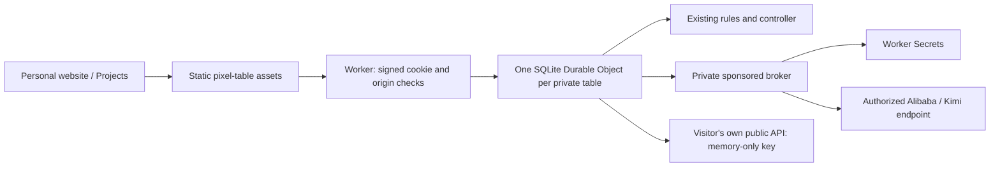

# Tony's website edition — Free hosting

**The default deployment is compatible with Cloudflare Workers Free.**
`wrangler.jsonc` uses static assets, SQLite Durable Objects and Worker Secrets.
It requires neither Containers nor R2, and does not require upgrading to a
Workers Paid subscription. Usage must remain within Cloudflare's free limits.

The website calls the game **Eighty — Classic Chinese Card Game**.
Its project cover is Collector’s Table, selected by Tony.

## One game repository

Keep `codex/tonytheyang-site` as a maintained, long-lived branch in
`tonyyunyang/80-fen-shengji`. It began at
`aa4003317dacb393e4997737e357bbf19dd45151` on `main`.

| Location | Owns |
| --- | --- |
| This repository / `main` | Shared rules, controllers, practice policy, pixel table and normal Node/BYOK app. |
| This repository / `codex/tonytheyang-site` | Website hosting adapters, sponsored connections and deployment configuration. |
| `tonytheyang.com` | Project link and promotional cover artwork. It does not vendor the game. |

Develop general game improvements for `main`, then merge the reviewed `main`
into this branch. Keep website-specific changes here. Do not delete this
branch as part of routine merged-feature cleanup. The intended public origin
is live at `https://eighty.tonytheyang.com/` as of September 12, 2026.

## Why Secrets do not need a container

Worker Secrets are private runtime bindings. The browser requests an action;
the backend reads the key and calls the provider. The key is not sent to the
browser or copied into frontend JavaScript. GitHub Actions secrets can supply
a deployment, but putting their values into a frontend build would publish
those values to visitors.

The original container option preserved the Node server with few adaptations.
Its runtime, not secret storage, required Workers Paid. The default has now
been adapted to native Workers/SQLite Durable Objects. The optional legacy
container configuration remains in `wrangler.container.jsonc`; use it only if
that separate hosting choice is explicitly wanted. It is not the default build.

## Free runtime



The game remains server-authoritative. Visitors cannot select another table
by providing an ID, send replacement state, or play a model seat's cards.
Each model gets only its own observation; the shared 12-second decision
limit, receipt-time bidding validation and private bidding timing remain.

Signed, expiring HttpOnly cookies choose the table. CSRF tokens and revisions
persist with the SQLite checkpoint so hibernation does not invalidate a
legitimate next click. WebSockets use Cloudflare's hibernation API; idle
heartbeats are answered without running the game JavaScript. A disconnected
or hidden table pauses after the existing grace period. Saves expire after
seven idle days. There is no continuously running Docker process.

The Free mode offers the host's provided connections, visitors' own URL/key
connections, and free practice bots. Personal connections support Chat
Completions, Responses, and Messages, with text-model discovery and manual
model IDs. Their keys stay only in the owning table's memory; SQLite retains
connection metadata, never keys. Keys clear after 30 minutes without public
browser activity or on a Worker restart. While keys are present, a timer keeps
the object resident and consumes active-duration quota. See the separate
[Workers network and credential contract](security-and-deployment.md).

The optional Node worker-thread endgame sampler is unavailable in this mode;
normal practice play and the model's own-hand/public-information decision
path remain. The normal Node app retains its threaded-analysis feature.
The preserved practice core is unchanged; no alternate table interface is added.

`public/index.html` stays the only runtime HTML entry. The asset build copies
that existing client and its six intentionally public shared modules into
ignored `dist/free-assets/`. It does not copy server code, local saves, private
keys, `.dev.vars`, or the personal website's Lab.

## Authorized providers and private keys

The operator has authorized the supported provider endpoints for this
website. The accepted list includes ordinary API endpoints and the selected
Alibaba Coding/Token Plan and Kimi Code endpoints. A product name is not used
as a blanket authorization prohibition. Use the credentials and billing terms
approved for this deployment; do not put agreement documents or keys in Git.

Host provider keys exist only as Worker Secrets. Public profiles contain fixed
model IDs and endpoint metadata, never key values. Only a validated game
controller calls the internal broker; no generic model proxy is exposed to
visitors. Sponsored requests cannot choose an arbitrary URL or credential. Provider
responses are redacted after JSON decoding, including escaped key echoes.

Sponsored connections are read-only. An operator may explicitly mark one as
`default` for the three bot seats of a fresh visitor. Retired models return to
practice bots. Daily request caps apply per session, per salted-IP visitor,
and globally, with a per-call output cap. Model failures, timeouts and exhausted
allowances retain the existing practice fallback and its separate provenance.
These are request caps, not a guaranteed currency ceiling. No live inference
is authorized merely by running tests or possessing a saved key.

The base local-review configuration keeps sponsorship **off**, with zero
request budgets. Production uses the explicit profile below. The game can
also be played with free practice bots. The default admission limit is 100
new browser tables per day, with per-visitor creation limits; an existing valid
cookie continues to select its table. Cookies cannot be invented to bypass
this gate.

## Free limits

As checked on September 11, 2026, Workers Free includes 100,000 dynamic requests
per day and 10 ms of Worker CPU per invocation. SQLite Durable Objects are also
available on Free, with their own request, active-duration and storage quotas.
Exceeding a Free limit makes the affected operation fail; it does not silently
upgrade the account. Model usage is governed separately by the provider terms.

This is a Free-compatible implementation, not an unlimited-traffic or production
capacity guarantee. Validate the actual account usage after launch before
raising limits. Sources: [Workers pricing](https://developers.cloudflare.com/workers/platform/pricing/),
[Durable Objects pricing](https://developers.cloudflare.com/durable-objects/platform/pricing/),
[Durable Object limits](https://developers.cloudflare.com/durable-objects/platform/limits/),
and [Worker Secrets](https://developers.cloudflare.com/workers/configuration/secrets/).

## Local review and verification

```sh
npm ci --ignore-scripts
npm run dev:free
# Optional alternate local port:
npm run dev:free -- --port 8235
```

The helper builds the existing client, removes production routes from the
local configuration, and uses an isolated ignored `output/free-local/` folder.
Its generated `.dev.vars` contains a local session-signing secret with mode
0600. Sponsorship defaults to off; it never imports keys from the canonical
checkout's `.env`. The website's local project link uses port 8231.

```sh
npm test
npm run check
npm run test:free-worker
npm run deploy:check
```

Native local checks use synthetic provider responses. They cover signed
cookies, origin/CSRF isolation, private views, WebSocket heartbeats, legal and
stale actions, and SQLite recovery across restart. The default deployment
precheck builds the Worker and static assets without Docker.

## Production configuration

`wrangler.jsonc` now has an explicit `production` environment for
`eighty-tonytheyang` at `https://eighty.tonytheyang.com/`. The base environment
continues to use practice bots for ordinary local review.

| Setting | Initial production value |
| --- | --- |
| Default AI | Alibaba Token Plan / `qwen3.8-flash` |
| Other hosted text models | `qwen3.8-max`, `qwen3.7-plus`, `qwen3.7-max`, `qwen3.6-flash`, `deepseek-v4-pro`, `deepseek-v4-flash-0731`, `glm-5.2` |
| Personal connections | Enabled; each visitor may provide their own public HTTPS base URL and key. |
| Kimi Code | Disabled in the public picker: its endpoint returns HTTP 403 from Cloudflare; the private key binding is retained. |
| Daily allowance across the site | 2,000 attempted model requests |
| Daily allowance per visitor and table | 500 attempted model requests |
| Maximum output per call | 512 tokens |
| New browser tables per day | 100 |

Visitors choose the supplied models without entering a key. Request limits
are enforced by the existing durable broker; exhausted allowances use the
existing practice fallback. Change these values in `env.production.vars`
and redeploy so this branch remains the source of configuration.

The eight hosted IDs match the text models returned by the authorized Token
Plan endpoint on September 12, 2026. Image, audio, and video IDs are excluded.
One provider profile owns this model list; the broker validates the selected
ID against it before using the host key. Flash remains the explicit default.
The same seat can instead use a personal connection, including an OpenRouter
Chat Completions base URL. Such requests use only that visitor's key.

A bounded production check returned one valid real game action from each of
the eight hosted models. A separate personal-connection check discovered the
same eight text IDs and returned a valid Flash action through the Workers
public-network adapter. Test tables were paused and the personal test key
was cleared. These are connection/action-format checks, not strength or
long-running reliability guarantees. Native runtime regression tests also
cover Workers DNS results that contain CNAME aliases alongside IP addresses.

The active production environment requires `EIGHTY_GATEWAY_SECRET` and
`SPONSOR_ALIBABA_API_KEY` as Worker Secrets. `SPONSOR_KIMI_API_KEY` is also
stored privately, but its profile is disabled until a live Cloudflare test
succeeds. The gateway value must be random and at least 32
characters. Keep an existing gateway secret across ordinary deployments to
preserve signed sessions. Profiles contain only the secret binding names.

## Publish from this maintained branch

```sh
npx wrangler login
npm run deploy:production:check
npm run deploy:production -- --secrets-file output/cloudflare-production/secrets.json
```

The first deployment's JSON file contains the private bindings and lives
in ignored, mode-0600 local storage. It is passed directly to Wrangler;
it is not part of the asset build, repository, browser bundle, or logs.
For a worker that already has these secrets, subsequent code deployments use
`npm run deploy:production` without uploading the file again. Wrangler retains
omitted existing secrets.

After login, confirm the Cloudflare account owns the `tonytheyang.com` zone
and inspect any existing worker/domain binding before publishing. Use Workers
Free; this configuration needs no container, R2 bucket, or paid-plan upgrade.
Verify `/api/health`, a fresh private table, WebSocket presence, and a bounded
real-model action on the actual hostname after deployment.

For Cloudflare Git integration, connect this repository and the maintained
`codex/tonytheyang-site` branch. Install with `npm ci --ignore-scripts` and use
`npm run deploy:production` as the deploy command. Configure the Worker Secrets
before enabling subsequent automatic builds. This does not publish the
personal website or its private Lab.

On September 12, 2026, both configured endpoints returned their model lists.
A bounded two-request check used the real observation builder, hosted
connection adapter, sponsored broker and action parser: Qwen and Kimi each
returned a valid declaration action in about two seconds, without fallback.
This is connectivity and protocol verification, not a playing-strength claim
or a Cloudflare production verification. Private results are kept in ignored
`output/cloudflare-production/`. Cloudflare deployment is now live. The custom domain serves HTTPS, the
account remains on Workers Free, and all three key bindings are `secret_text`.
Live checks verified signed session isolation, CSRF/origin rejection, private
paths returning 404, hibernating WebSocket heartbeats, and a valid Qwen action
through the deployed controller and broker. The test tables were paused.

Kimi succeeds from the local backend but repeatedly returns a non-JSON HTTP
403 from Cloudflare, including with documented public-Internet fetch routing.
It is therefore excluded from active `SPONSOR_PROFILES`; its secret remains
stored for a future authorized endpoint/access fix. No client identity or
network restriction is bypassed. Re-enable the Kimi profile only after a
bounded live game action succeeds from the deployed Worker.

The operator-only `/_eighty/provider-check` diagnostic is disabled by default
and in normal production. When explicitly enabled, it requires the gateway
Bearer secret, uses fixed provider endpoints/prompts, and consumes broker
allowance. Its response includes only status and sanitized request metadata;
no provider body or key is returned. Disable it after a diagnostic session.
The September 12 probe confirmed that the private binding matches the local
key and that both official protocols receive an upstream HTML 403. The Kimi
console's successful Eighty entry aligns with the earlier local check. Keep
the sanitized timestamps and Ray IDs in ignored
`output/model-expansion/Kimi-Cloudflare-diagnostics.md` for operator follow-up;
private runtime records do not belong in the public repository.

The broker preserves sanitized upstream status/category and numeric Cloudflare
error codes in audit metadata; provider error bodies and private keys are not
logged. `global_fetch_strictly_public` makes outbound provider requests use
normal public-Internet routing; table and broker calls remain internal bindings.
