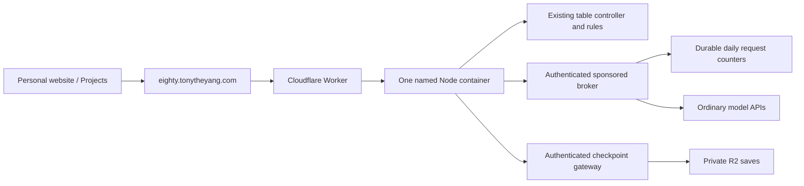

# Tony's website edition

This is the deployment branch for Eighty on Tony's personal website.
**Keep `codex/tonytheyang-site` as a long-lived branch in this repository.**
Tony explicitly requested a maintained website edition rather than another
copy of the game inside the website repository.

The branch began at `aa4003317dacb393e4997737e357bbf19dd45151` on `main`.
The website's Projects page calls the game **Eighty**, with the subtitle
**Classic Chinese Card Game**.

## Ownership and updates

| Repository / branch | Owns |
| --- | --- |
| `80-fen-shengji` / `main` | Shared game, rules, table, practice policy and normal BYOK version. |
| `80-fen-shengji` / `codex/tonytheyang-site` | This website edition, Cloudflare deployment, sponsored connections and hosting adapters. |
| `tonytheyang.com` | Projects entry, original promotional card-back artwork and its private design gallery. |

The website does not vendor the game, its API server, or its build output.
Its project entry links to `https://eighty.tonytheyang.com/`. The local cover
component uses `http://127.0.0.1:8231/` on localhost. The domain is configured
in this branch's `wrangler.jsonc`; it has not been published by creating these
files.

Develop general improvements on a feature branch for `main`, then merge the
reviewed `main` into this branch. Keep website-specific changes here. Do not
delete this branch as part of routine merged-feature cleanup. Tag approved
website releases so a deployment can be rolled back to a known commit.

## Runtime



The Node implementation, single pixel table, cookie/CSRF boundaries,
continuous dealing, hidden-information redaction, and shared 12-second model
deadline remain in use. Containers preserve Node filesystem, HTTPS transport
and worker-thread behavior without rewriting the game for a different engine.
The container uses a stable name; random routing would split one browser's
in-memory table across processes.

Hosted checkpoints go to private R2, expire after seven idle days, and restore
paused after container restart. They contain game state and credential-free
connection settings. Browser-supplied API keys remain memory-only and need
re-entry after restart. The container filesystem is not treated as durable.
Each checkpoint is limited to 1 MiB; a storage outage is reported instead of
silently pretending a saved game does not exist.

There is one `basic` container, at most 16 active browser sessions, and no
cross-device multiplayer rooms. This is an initial bounded deployment, not
a claim of capacity at scale. Load-test before raising session or instance
limits. The [Cloudflare Containers documentation](https://developers.cloudflare.com/containers/)
requires Workers Paid; container and R2 charges are separate from model usage.

## Sponsored AI

Sponsorship is **off** in the checked-in configuration. With it off, visitors
can still play with the three free practice bots. No model request is made
by merely opening the game or its setup screen.

When enabled by the operator:

- Provider keys exist only as Worker secrets. They are never shipped to the
  browser, put in profile metadata, stored in checkpoints, or passed into the
  game container. The container has a separate internal gateway credential.
- Hosted connections are read-only. Visitors may still add their own personal
  connections; those retain the existing cookie isolation and DNS-pinned
  transport. Editing a personal profile cannot redirect a sponsored key.
- An operator may explicitly mark one sponsored profile as `default`. Fresh
  visitors then get that model in the three bot seats. Existing saved setups
  are preserved. An ordinary BYOK model list never auto-selects its first item.
- Durable counters impose per-browser-session, salted-IP visitor, and global
  UTC-day request limits. A new cookie does not reset the IP or global limit.
  Shared networks may share the IP limit; this is not account-based identity.
- Every upstream attempt counts, including repairs and failures. The broker
  also caps output tokens, forces one non-streaming completion, rejects
  redirects, bounds bodies and strips echoed keys. Failure or exhaustion
  uses the existing practice fallback; actual model/fallback provenance is
  retained. Private bidding does not display live quota activity.

These are **request limits, not a guaranteed dollar ceiling**. Set limits
against the chosen models' actual prices and configure provider-side billing
controls before enabling public use. No paid smoke test is implied by setup.

The currently documented Alibaba Coding/Token Plans exclude application
backends, including the [personal Token Plan](https://help.aliyun.com/zh/model-studio/token-plan-personal-overview)
and [team Token Plan](https://help.aliyun.com/zh/model-studio/token-plan-team-overview).
[Kimi Code](https://www.kimi.com/code/docs/en/kimi-code/community-guidelines.html)
is for personal interactive use. This broker accepts ordinary DashScope or
Moonshot API endpoints; it does not spoof coding-tool identities or route a
public game through those subscriptions. Use applicable standard API access,
or obtain written provider confirmation for a different arrangement.

## Prepare a deployment

Do these steps from this repository and branch, not from the personal website.

1. Verify `npm test`, `npm run check`, and `npm run test:site-worker`; use only offline fixtures until a
   separate, bounded live-test allowance is provided.
2. Connect a Cloudflare Workers Builds project to `80-fen-shengji`, with
   production branch `codex/tonytheyang-site`. Install with
   `npm ci --ignore-scripts`; deploy with `npx wrangler deploy`.
3. Create the private R2 bucket `eighty-site-saves`, matching `wrangler.jsonc`.
   Add a bucket lifecycle rule removing `sessions/` objects after seven days.
4. Set `EIGHTY_GATEWAY_SECRET` with `npx wrangler secret put
   EIGHTY_GATEWAY_SECRET`. Use a new random secret of at least 32 characters.
   Keep it out of code, screenshots, and chat. This secret is required even
   when model sponsorship is off, because it protects the container and saves.
5. Confirm the custom domain, Workers Paid/Containers access, R2 binding, and
   the configured capacity. Deploy the free-bot version first; verify browser
   play, save/restore, isolation, and a quiet console on the actual domain.
6. Only when applicable API credentials and explicit limits are ready, add
   `SPONSOR_ALIBABA_API_KEY` and/or `SPONSOR_KIMI_API_KEY` using Worker secrets.
   Fill `SPONSOR_PROFILES`, the three positive request limits, and the output
   limit. Then set `SPONSORED_ENABLED` to `true` and redeploy. Do not put keys
   inside the profiles JSON.
7. Publish the personal website's Projects entry after the game domain works.
   The private lab remains excluded from that separate website deployment.

One public profile has this shape (replace the model placeholder with a model
actually available through your standard API):

```json
{
  "id": "sponsored-alibaba",
  "name": "AI on Tony",
  "model": "replace-with-your-model-id",
  "baseUrl": "https://dashscope-intl.aliyuncs.com/compatible-mode/v1",
  "keySecret": "SPONSOR_ALIBABA_API_KEY",
  "default": true
}
```

For Kimi's ordinary API, use an appropriate Moonshot `/v1` endpoint and
`SPONSOR_KIMI_API_KEY`. The configuration accepts up to four fixed model
profiles and at most one default. It intentionally ships without model or
spending assumptions.

## Local review

```sh
npm ci --ignore-scripts
HOST=127.0.0.1 PORT=8231 EIGHTY_SITE_EDITION=1 npm start
```

No `.env` is read and sponsorship remains off without explicit configuration.
Local saves use the ignored `data/` directory. Docker's build context is an
allowlist: only the app, dependencies and license notices enter the image.
The build excludes keys, local saves, private output, Git state and media docs.

```sh
docker build --platform linux/amd64 -t eighty-site-preview:local .
npx wrangler deploy --dry-run
```

Container builds require access to the official Node image registry. A dry
run does not publish the service. Record the actual result, including any
registry/network failure, rather than treating a successful JavaScript bundle
as a verified container deployment.

References: [environment variables and secrets](https://developers.cloudflare.com/containers/examples/env-vars-and-secrets/),
[container storage lifetime](https://developers.cloudflare.com/containers/faq/),
[R2 Worker API](https://developers.cloudflare.com/r2/api/workers/workers-api-reference/),
and the existing [security model](security-and-deployment.md).
