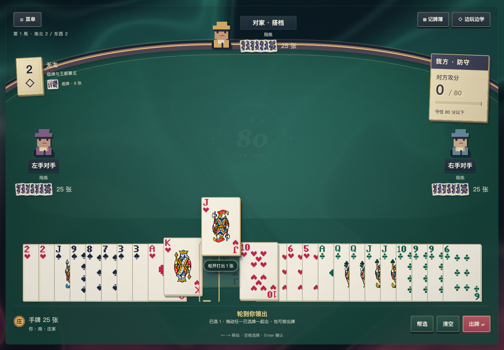

# Pixel table experience

The approved pixel table is the single production interface. `public/index.html` opens the game menu; the table is connected to the real engine, not scripted hands. The original art direction is retained: green felt, a curved rail, paper cards, pixel people and the generated court/joker/back atlas.

## Navigation

A fresh tab opens the main menu with New game, Rules, Settings and Credits, plus a language icon and Chinese/English picker (Chinese by default). An existing game adds Continue. Reloading an active game in the same tab reconnects to that game. Returning to the main menu pauses the current game, which can be continued later.

Delayed state responses cannot replace the chosen player's view or switch back to the session in which an earlier HTTP request began. Revision and game-version ordering applies within one server session; reconnecting to a new session can restore an earlier saved state. Only the human who owns the displayed hand receives play controls.

The Chinese and English menu titles are original drawn SVG letterforms, with stepped contours, paper faces, gold depth and crimson inlays. They do not depend on an installed display font; accessible text remains in the heading.

Dialogs keep their heading and close button visible while the content scrolls. Escape, the close button and a primary click on the dark backdrop dismiss them. A gesture that starts inside the dialog, such as selecting text and dragging out, does not dismiss it. Dismissing Pause resumes the table; dismissing Rules opened from Pause returns to Pause. Password fields clear on dismissal, and the page behind a modal cannot scroll.

Each API seat has an inline Add or Manage connection button, including a clear explanation when no connection exists. The connection dialog identifies that seat. Saving links the connection to the originating seat; closing returns keyboard focus to its model picker. An unavailable previous model is cleared instead of silently substituting another model. The shared API connections button remains available in the right panel.

New game opens a separate seat and table setup, initialized from the saved draft. General Settings offers hand size, table-card size, text size, suit palette, motion, texture, Full/Soft/Off light and effects, hints, drag-to-play and optional synthesized sound/volume. Starting another game while one exists requires confirmation and resets levels to 2; it uses the draft seat/rule settings. Next deal preserves the current table's seats, rules and match progression. Settings do not silently alter that existing table.

Seat setup groups You and Teammate (across), then Left opponent (上家) and Right opponent (下家), matching the initial human's table perspective. The diagram, menu summary, accessible control names and per-seat connection hints share that mapping. Display order never changes saved seat indices or model assignments. Multiple humans use the first human's perspective; spectator setup shows two teams with their positions instead of claiming a human seat.

Seats, provider connections, model choices, prompt language, optional endgame analysis, rule options, request/output/deadline limits, suit colors and card motion are configured outside the game. In-game controls are Menu/Pause, Notebook, Learn, card selection and confirmation. Pause offers Resume, Rules, Autoplay and Main menu. Changing credentials retains the existing server-side pause/cancellation behavior.

## One hand row

Dealing gives each player 25 cards. The dealer temporarily has 33 after taking the kitty, then confirms eight cards to return to 25. Neither the game nor its settings has a 25/33 scene switch or a two-row option.

`hand-layout.js` computes one row from the actual hand count. On desktop, the camera fits the entire scene, including the minimum width needed for 33 large cards; hover supplies the close view. On phones, the same renderer uses native viewport coordinates, a horizontally scrolling hand and anchored controls. Standard portrait cards are 96 pixels wide, smaller screens use 72–88 pixels, and touch strips remain at least 44 pixels wide. A horizontal swipe browses without selecting or playing; a tap selects, and an upward drag retains normal play validation. Selection and confirmation also work without dragging. Short landscape screens arrange the four played piles in a labelled row above the hand. A repeated 25→33→25 sequence cannot inherit a second row. The page does not scroll during play.

Resting slots are independent of moving card faces. Hover opens a full-card reading gap and picks against its stable target geometry; ownership does not follow animated DOM rectangles. The hover controller caches geometry and uses a continuous, time-based lift across neighboring cards. It stops JavaScript frames when settled. Selection retains physical identities. Live style attributes and immutable face subtrees survive public state updates, avoiding a reset of the hover pose.

Selected cards stay at a fixed raised height and do not join the hover wave, cursor tilt or idle bob. Selection and deselection use a critically damped transition that retains position and velocity during quick toggles. Their exposed upper strip is directly clickable, including when the pointer arrives from outside the hand. Cancelled group drags return to each selected card's responsive target height. These original transitions draw on the separation of hover, selection and drag states observed in the locally installed [Balatro](https://www.playbalatro.com/); no game code or assets are copied into this implementation.

Notebook → Table history shows each accepted declaration's player, single/pair strength and exact exposed cards. Earlier declarations remain present after an overcall, and the same public events are retained in the completed deal archive.

A pointer drag freezes the hand's hover poses. Starting on a selected card captures the entire selection in hand order; starting on an unselected card captures only that card. The carried faces gather into a compact fan with a count badge. A deliberate upward lift across the hand edge enters the wider felt area; the fingertip need not reach a small central rectangle. A soft glow and a hint beneath the packet describe the complete play and its legality. Returning to the hand cancels; a small wobble or horizontal swipe cannot submit. A valid release submits exactly once through the validated endpoint; incompatible drops return every card and preserve selection. Public redraws preserve carried identities, and returns begin at the current animated pose.

Click still selects and lifts in hand; there is no duplicate preview on the table. The Play button and Enter still confirm selected groups. Burial uses eight progress marks and the selected point total, then confirms all eight cards with the button. Disabling drag-to-play makes drops select instead. Escape, lost capture, blur and pointer cancellation return the entire group without submitting. Tab cancels before moving focus; selection keys cannot change a held group. A resize or hidden page cancels immediately; the release handler also rejects changed viewport dimensions or zoom before a delayed resize event arrives. Reduced motion keeps the group interaction but removes decorative tilt, gathering and return animations.

Captured from a synthetic local deal using the real renderer and pointer gesture; no provider calls.

Click toggles a card, double-click selects its matching pair, Shift-click/Shift-arrow select ranges, arrows/Home/End move focus, Space selects and Enter confirms a valid play. Escape cancels a drag or selection before opening the pause menu. Validation explains illegal suit/count/structure choices; the server remains authoritative for all actions and throw adjudication.

## The actual table

Your hand is at the bottom; your partner is opposite and opponents are at the sides. The view rotates for shared-device human handoffs. Opponent hands remain backs plus public counts. A gold dealer token follows the actual dealer, including a token beside your hand when you deal.

Turn instructions, selection feedback, declaration buttons and the closing countdown occupy the control row below the hand. The central felt holds cards and the dealing stack. The kitty marker belongs to the trump information, away from the previous-trick buttons. The opposite seat uses a compact horizontal arrangement on desktop, and public hand counts sit beside the decorative backs.

`table-layout.js` measures the hand's entire hover area, card size, captions, seat panels and score/trump information. It allocates separate spaces for played cards and controls, including four visible multi-card plays. Fans tighten their spacing when needed while keeping individual card faces at the selected size. Side portraits stay below the score/trump panels. A measured logical scene is uniformly scaled to the available width and height; short windows do not crop the footer or require page scrolling. The desktop arrangement remains intact at narrow widths, where the whole scene is smaller. Preferences recompute the fit without retaining the previous size. Spectators retain a visible status/countdown beside the bottom seat.

Accepted declaration cards stay in their owners' table positions until dealing and closing finish. Their visual hand counts account for the revealed cards; the engine retains physical ownership. Countered declarations stay visible as public evidence until settlement. Only accepted events are displayed, never eligibility or private work. The first browser-game dealer is chosen randomly; later dealers follow the match rules.

The trump tile displays the actual level and trump suit, or a clearly provisional declaration. The score ticket always identifies attacker points and whether your team attacks or defends. While defending it reads “Opponent points / 80”; the goal is to hold that total below 80. Match levels cannot overwrite the level of the deal that just ended.

Cards arrive on the real dealing clock. Public plays occupy their owners' positions. A finished trick holds for 850ms, flips for 300ms and collects toward its winner for 450ms. This uses the existing `TrickFlow` presentation clock and never delays an engine action or API deadline. Fast updates coalesce instead of creating an animation backlog. Click a played fan or collected-trick marker to inspect all of its cards.

Dealing flights and trick collection use the actual stack, seat-back and hand positions after layout. Moving the instructions or changing a preference therefore does not leave the animation travelling toward an old percentage-based location. Pointer hit testing and card-flight endpoints convert between viewport pixels and logical scene units. Layout runs on state/size changes; pointer hover continues to use its existing stable geometry and animation controller.

The result panel displays the winning team, trick points, kitty calculation, updated levels and the revealed kitty. It offers Next deal or Main menu. Passing A is labeled as completing the match, not as a joker rank.

## Light, motion and sound

The arcade finish keeps the same felt table, deck atlas and HTML controls. Original procedural ink moves behind the table; paper edges, brass rails, a faint felt emblem and optional scanlines add depth. Menu cards float independently and catch a foil glint. Selected and carried cards get a brief surface glint without changing the hover controller or the carried identities.

Public plays land from their owner's direction. Pairs get a small burst; tractors get a short named accent. Accepted declarations light up the revealed cards and trump tile. A completed trick highlights its winner, shows the actual points and sends a few sparks toward the score ticket when the attackers score. Defensive captures travel to the winner instead. The ticket's progress strip represents the 80-point threshold; the printed total remains authoritative. The result opens after the existing hold/flip/collect sequence, with a brief visual count-up and a team-appropriate finish. Its accessible score is the final total throughout.

Full effects is the default. Soft lowers background resolution and cadence, omits particles and foil, and keeps simple event accents. Off removes the animated background and event flourishes; normal card handling still follows the separate Animation setting. Turning Animation off, or enabling system reduced motion, stops decorative motion and keeps all controls usable. The background has a CSS fallback when WebGL is unavailable or its context is lost. Its drawing buffer fits within 960×600 in Full or 640×600 in Soft, with elapsed-time drawing caps of 30 and 20 frames per second. These are render budgets, not device performance guarantees. Hidden tabs and paused tables stop drawing; game rules and API timing never wait for a frame.

`effect-flow.js` consumes only an explicit list of public events and the shared dealt count. It never reads bidding eligibility, private draws, hidden burial cards, model work or usage records. It suppresses historical effects after loading, switching viewers, redealing, hiding or pausing; rapid updates coalesce. The effect layer contains at most 80 decorative elements and clears on pause, visibility changes and navigation.

Music and all table sounds are enabled by default, starting after a user gesture. Saved mute and volume choices are retained; Reset preferences restores enabled audio and unlocks playback from that click. Local synthesis supplies fuller paper rustles, wooden landings, declaration notes, collection sounds and short result phrases. The fourth play in a trick retains its landing accent. Effects default to 50% and music to 30% on fresh preferences. A compressor controls dense effects, and audible effects briefly duck the music through a separate gain bus, then restore it smoothly without restarting the track. The approved After Eighty file is downloaded/decoded once after audio is enabled and unlocked. All sound cues follow the public-event boundary.

## Dealing presentation

At the default 250ms draw interval, independent 320ms flights may overlap. A flight captures its origin and destination in screen coordinates when a new public draw arrives; later declarations and repaints never retarget it. At most four decorative flights exist, with no backlog after reconnect, pause or hiding. Resizing cancels old geometry. The deck reserves room for declared cards before any declaration, while the bid row keeps its height when options disappear. Hand reflow animates a visual wrapper independently of fixed hit slots and hover lifts. Reduced motion skips these animations without changing the deal clock or private bidding behavior.

## Learning, records and privacy

Notebook tabs show factual card memory, public history and permitted usage records. Current-deal usage remains deferred during continuous play, including while menus or the notebook are open. Previous-game usage remains available. The atlas supplies visible joker pictures in the notebook too.

Learn can be enabled during play. Its questions derive from the human's permitted information after a trick. Answering, revealing an explanation or closing the exercise does not send an API request, pause the game or change its score. The handoff curtain also suppresses private notebook/quiz material until the next human takes over.

The existing cookie/CSRF boundary, session-owned in-memory keys, private observations, shared 12-second deadline, continuous-dealing privacy and save/restore behavior are retained. The browser never receives a shuffle seed or all hands. No demo-state endpoint is added; controlled browser fixtures live in ignored local output.

## Rendering and retirement

Cards and controls are accessible HTML. Pixel portraits are small SVGs; court art is one local WebP atlas; rank and suit glyphs are small code-native SVGs. Symmetric pip fields reserve both index corners; court figures keep their 2:3 proportions and are centered. CSS crops atlas cell edges and blends the paper without changing the retained source atlas. CSS and short Web Animations handle surface effects; optional native WebGL draws only the background. There is no renderer package dependency. Reduced motion disables decorative movement. Optional audio is synthesized locally only after a user gesture.

Visual reference: [Balatro official press kit](https://www.playbalatro.com/press-kit/). Its card hierarchy and pixel details informed the refinements; the retained generated atlas remains unchanged.

The previous table renderer, its CSS, mesh, Blender sources and Three.js runtime dependency have been removed from the current tree. Historical commits remain the rollback record; they are not selectable game versions. New interface work must update the canonical pixel game, not add another standalone hand lab.
